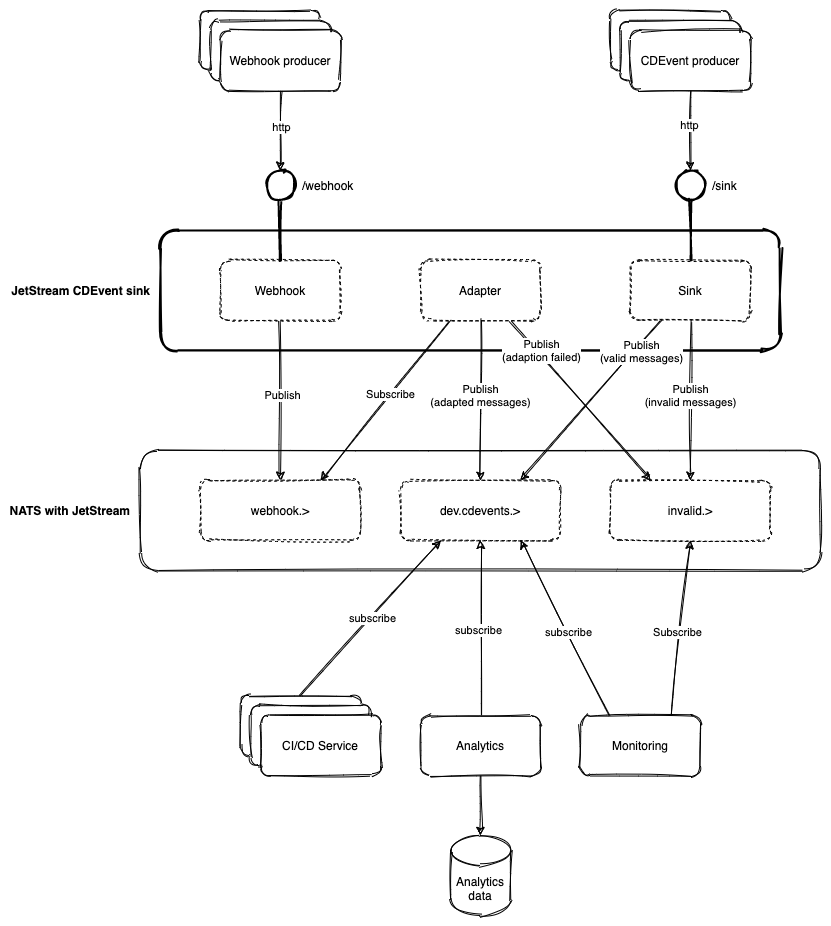

# Jetstream CDEvent Sink

This project is a [Nats JetStream][1] event sink for [CDEvents][1].

It has HTTP endpoints both for ingesting messages in CDEvents format and for adapting messages of various formats into CDEvents.

It requires a Nats server with JetStream enabled and will create three streams:
- CDEvent output stream (bound to `dev.cdevents.>` by default)
- Webhook adapter work queue stream (bound to `webhook.>` by default)
- Invalid message channel stream (bound to `invalid.>` by default)

## Architecture

[1]: https://docs.nats.io/nats-concepts/jetstream
[2]: https://cdevents.dev/
